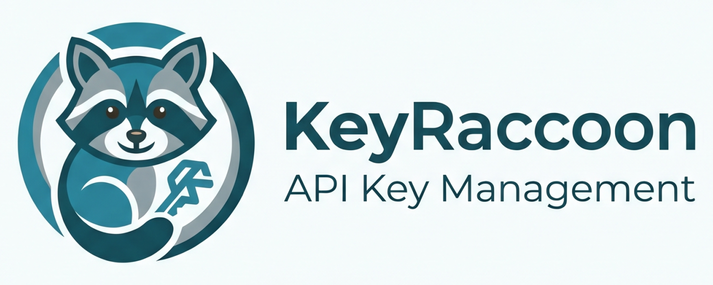

# KeyRaccoon



Production-ready OpenAI-compatible API proxy dengan user management, channel routing, dan proxy management.

## Features

- **OpenAI-compatible API** — Drop-in replacement untuk OpenAI SDK
- **User Management** — JWT authentication dengan role-based access
- **Channel Routing** — Route requests ke multiple providers
- **Proxy Management** — Health checks dan auto-rotation
- **API Key Management** — Token tracking dan limit enforcement
- **Admin Dashboard** — Raycast-inspired dark UI untuk management
- **Real-time Analytics** — Redis-based token usage tracking
- **Security** — Rate limiting, security headers, input validation

## Quick Start

### Prerequisites

- Go 1.24+
- PostgreSQL 15+ (atau SQLite untuk development)
- Redis 7+
- Docker & Docker Compose (optional)

### Installation

1. Clone repository

```bash
git clone https://github.com/username/keyraccoon
cd keyraccoon
```

2. Setup environment

```bash
cp config/.env.example config/.env.local
# Edit config/.env.local dengan database credentials
```

3. Start dependencies (optional dengan Docker)

```bash
docker compose up -d
```

4. Run server

```bash
go run ./cmd/server
```

5. Akses dashboard di `http://localhost:3000/dashboard`

Default admin credentials:
- Email: `admin@keyraccoon.com`
- Password: `adminpassword123`

## API Usage

### Authentication

```bash
curl -X POST http://localhost:3000/auth/login \
  -H "Content-Type: application/json" \
  -d '{
    "email": "admin@keyraccoon.com",
    "password": "adminpassword123"
  }'
```

### Chat Completions (OpenAI Compatible)

```bash
curl -X POST http://localhost:3000/api/v1/chat/completions \
  -H "Authorization: Bearer <api_key>" \
  -H "Content-Type: application/json" \
  -d '{
    "model": "gpt-4",
    "messages": [
      {"role": "user", "content": "Hello!"}
    ]
  }'
```

## Project Structure

```
KeyRaccoon/
├── cmd/
│   ├── server/          # HTTP server entry point
│   └── cli/             # CLI commands
├── internal/
│   ├── config/          # Configuration & connections
│   ├── models/          # Data models
│   ├── handlers/        # HTTP handlers
│   ├── services/        # Business logic
│   ├── middleware/      # HTTP middleware
│   ├── database/        # Database layer & migrations
│   ├── routes/          # Route definitions
│   ├── utils/           # Utilities
│   └── cli/             # CLI implementation
├── pkg/
│   └── logger/          # Structured logging
├── public/
│   └── dashboard/       # Admin dashboard (SPA)
├── tests/               # Load & integration tests
├── config/              # Configuration files
├── docker-compose.yml
├── Dockerfile
└── README.md
```

## Development

### Run tests

```bash
go test ./...
```

### Run load tests

```bash
go test -v ./tests
```

### Build binary

```bash
go build -o bin/keyraccoon ./cmd/server
```

## Deployment

### Docker build

```bash
docker build -t keyraccoon:latest .
docker run -p 3000:3000 --env-file config/.env.local keyraccoon:latest
```

### Docker Compose

```bash
docker compose up -d
```

### Environment variables

```env
SERVER_HOST=0.0.0.0
SERVER_PORT=3000
DB_HOST=postgres
DB_PORT=5432
DB_USER=postgres
DB_PASSWORD=your_secure_password
DB_NAME=keyraccoon
DB_SSL_MODE=disable
REDIS_HOST=redis
REDIS_PORT=6379
REDIS_PASSWORD=
JWT_SECRET=your_secure_jwt_secret
ADMIN_EMAIL=admin@keyraccoon.com
ADMIN_PASSWORD=adminpassword123
```

## Performance

- Response time: < 100ms (average)
- RPS capacity: 1000+ (per instance)
- Token tracking: Real-time dengan Redis
- Database: Optimized indexes untuk query performance
- Caching: Redis cache layer untuk frequently accessed data

## Security

- JWT authentication dengan expiry & refresh tokens
- API key validation dengan Bearer token
- Rate limiting (100 req/min default)
- Security headers via Helmet middleware
- SQL injection prevention via GORM parameterized queries
- XSS protection via Content Security Policy
- Input sanitization

## Design System

Dashboard menggunakan Raycast-inspired design system:

- Dark theme dengan near-black blue background (#07080a)
- Inter font dengan positive letter-spacing
- Multi-layer shadow system untuk depth
- Raycast Red (#FF6363) sebagai accent color
- Opacity-based hover transitions
- macOS-native aesthetic

## License

MIT
